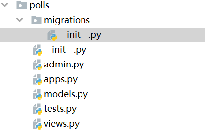
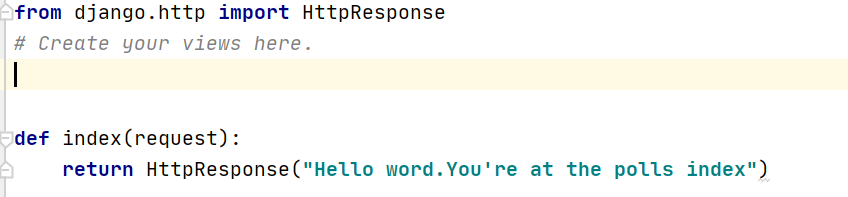
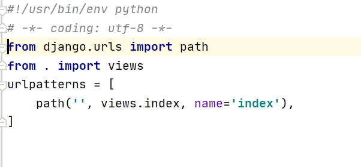
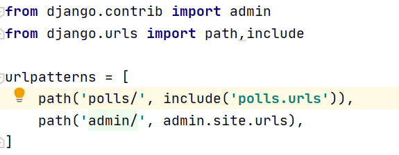
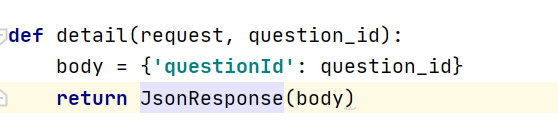
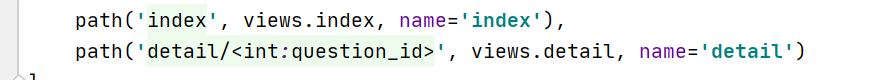
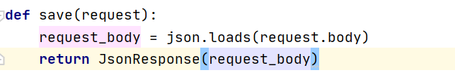
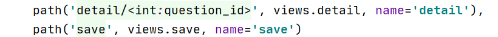

# kerl-machine-learn

**Anaconda(环境管理工具)**

****1.查看基本信息****：
 
 `conda info`
 

****2.新建虚拟环境****：

`conda create -n machine-lean python=3.6`
   
  
 

****3.查看虚拟环境****：

`conda env list`

  
 
****4.激活环境****：

`activate your_env_name`

 

****5.退出环境****：

`deactivate`

 

****6.配置国内镜像****:

`conda config --add channels http://mirrors.tuna.tsinghua.edu.cn/anaconda/pkgs/free/`

`conda config --add channels http://mirrors.tuna.tsinghua.edu.cn/anaconda/cloud/conda-forge `

`conda config --add channels http://mirrors.tuna.tsinghua.edu.cn/anaconda/cloud/msys2/`

**Python**

***Pip(依赖包管理工具)***

****1.查看环境已安装的依赖包****：

`pip list`

  可以使用`python -m pip install --upgrade pip`更新pip
  
****2.导出依赖包****：

*****2.1 只导出安装包信息*****：

`pip freeze > requirements.txt`

*****2.2 导出安装包whl文件*****：

`pip download -r requirements.txt
`

****3.导入依赖包****：

联网情况下：

`pip install -r requirements.txt`

没联网情况下：

`pip install -r requirements.txt -d local_dir`

****5.安装依赖包****:

******5.1 联网安装******:

`pip install Django==1.7`

******5.2 离线安装******:

需要预先下载whl文件

`pip install *.whl
`

需要预先下载tar包

`pip install Flask-WTF-0.10.0.tar.gz
`

**Django**
  
*****0.项目vs应用*****

`项目和应用有啥区别？应用是一个专门做某件事的网络应用程序——比如博客系统，或者公共记录的数据库，或者简单的投票程序。项目则是一个网站使用的配置和应用的集合。项目可以包含很多个应用。应用可以被很多个项目使用。
`

*****1.查看当前安装的Django版本*****

`python -m django --version
`

*****2.运行服务*****

`python manage.py runserver 0.0.0.0:port`

0.0.0.0表示可以被其他机器访问

`python manage.py runserver`

默认绑定到8000端口 

*****3.创建应用*****

`python manage.py startapp polls`

目录如下:

可能会出现name 'os' is not defined.解决方法:在setting.py文件中增加 import os

*****4.定义视图*****

******4.1******
在polls/view.py中追加如下代码：

******4.2******
在polls目录下,新建urls.py文件,并追加如下代码：

******4.3******
在项目中同名的根目录下的urls.py追加如下代码：

******4.4******
接收参数

*******4.4.1 GET*******

在polls/views.py中追加如下代码

在polls/urls.py中追加如下代码:

其中,int是参数的数据类型,question_id对应views方法的参数名

*******4.4.1 POST*******

在polls/views.py追加如下代码:

在polls/urls.py追加如下代码：

其中json是一个模块,需要import json

