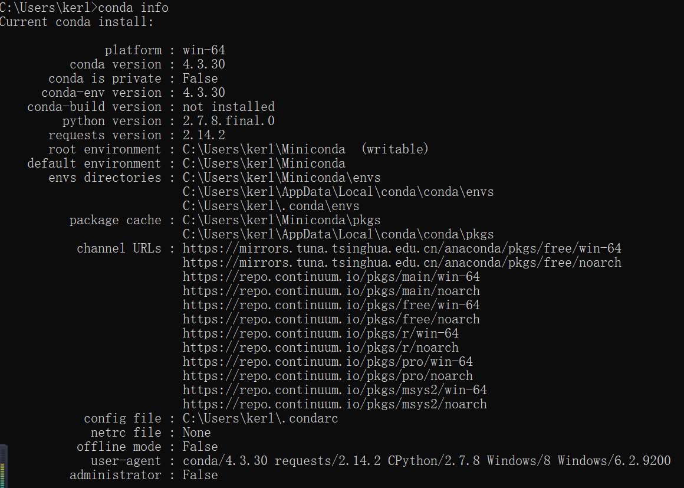

# kerl-machine-learn

**Anaconda(环境管理工具)**

****1.查看基本信息****：
 
 `conda info`
 

****2.新建虚拟环境****：

`conda create -n machine-lean python=3.6`
   
  
 

****3.查看虚拟环境****：

`conda env list`

  
 
****4.激活环境****：

`activate your_env_name`

 

****5.退出环境****：

`deactivate`

 

****6.配置国内镜像****:

`conda config --add channels http://mirrors.tuna.tsinghua.edu.cn/anaconda/pkgs/free/`

`conda config --add channels http://mirrors.tuna.tsinghua.edu.cn/anaconda/cloud/conda-forge `

`conda config --add channels http://mirrors.tuna.tsinghua.edu.cn/anaconda/cloud/msys2/`

**Python**

***Pip(依赖包管理工具)***

****1.查看环境已安装的依赖包****：

`pip list`

  可以使用`python -m pip install --upgrade pip`更新pip
  
****2.导出依赖包****：

*****2.1 只导出安装包信息*****：

`pip freeze > requirements.txt`

*****2.2 导出安装包whl文件*****：

`pip download -r requirements.txt
`

****3.导入依赖包****：

联网情况下：

`pip install -r requirements.txt`

没联网情况下：

`pip install -r requirements.txt -d local_dir`

****5.安装依赖包****:

******5.1 联网安装******:

`pip install Django==1.7`

******5.2 离线安装******:

需要预先下载whl文件

`pip install *.whl
`

需要预先下载tar包

`pip install Flask-WTF-0.10.0.tar.gz
`

